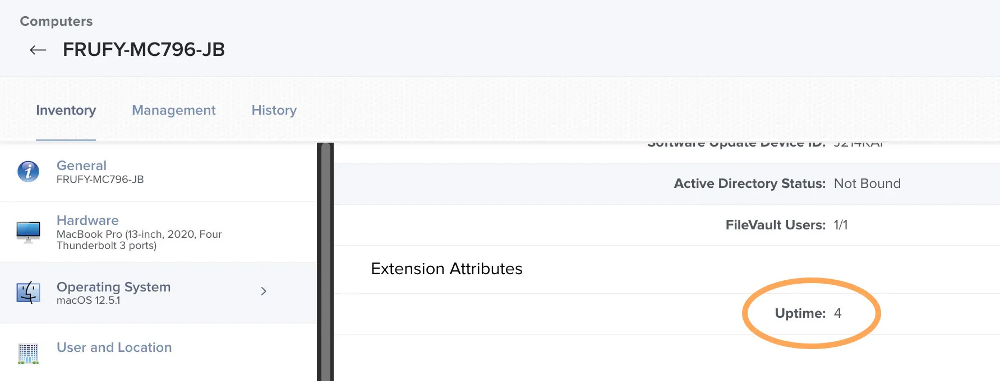
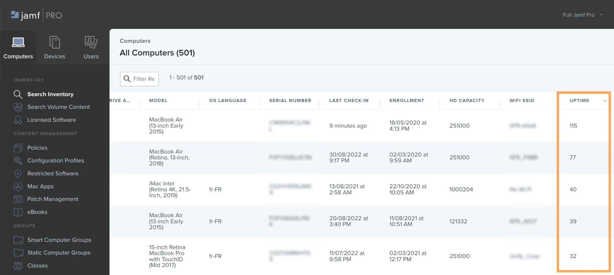

How long has a Mac been turned on? Here is a script/extension attribute to know.

In Jamf : ⚙️ > Extension Attributes > New 
Display name : Uptime 
Data type : Integer 
Inventory display : Operating System 
Input Type : Script 

At the next recon of a Mac take a look at what we find in a computer’s inventory. 

Now, go in ⚙️ > Inventory Display > Extension Attributes. Check uptime.
With an empty search, you can now sort devices by uptime.

